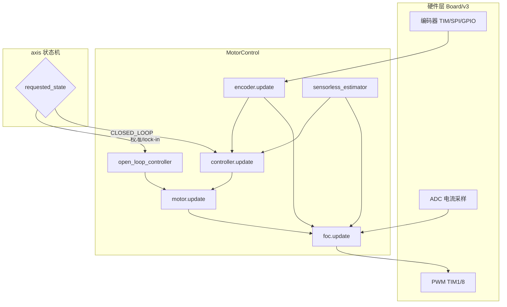

# ODrive 工程说明文档

> 路径：`Firmware/Board/v3/DOC/工程说明文档.md`  
> 适用仓库：`D:\Users\chen\Document\我的项目\ODrive`（ODrive v3.x 开源固件）  
> 相关文档：[修复过程.md](./修复过程.md)（Keil 编译/链接修复记录）

---

## 目录

1. [工程总览](#1-工程总览)
2. [顶层目录详解](#2-顶层目录详解)
3. [Firmware 目录完整说明](#3-firmware-目录完整说明)
4. [两条构建路径：GCC/Tup 与 Keil](#4-两条构建路径gcctup-与-keil)
5. [如何使用本工程](#5-如何使用本工程)
6. [FOC 与开环/闭环控制原理](#6-foc-与开环闭环控制原理)
7. [不同编码器的配置与修改](#7-不同编码器的配置与修改)
8. [二次开发：需要添加/修改的文件](#8-二次开发需要添加修改的文件)
9. [12V 供电与硬件版本配置](#9-12v-供电与硬件版本配置)
10. [推荐学习与调试流程](#10-推荐学习与调试流程)
11. [常见问题](#11-常见问题)

---

## 1. 工程总览

本仓库是 **ODrive v3.x** 电机驱动器完整开源项目（官方已标记 NRND，不再活跃维护），包含：

- 烧录到 **STM32F405** 的固件（FOC、双轴、多编码器、USB/UART/CAN）
- Python 调试工具 **odrivetool**
- 文档、GUI、Arduino 库、分析脚本

**规模统计（本仓库实测）：**

| 范围 | 文件数 |
|------|--------|
| 整个 `ODrive/` | 约 795 |
| `Firmware/` | 约 546 |
| `Board/v3/` | 约 275（含 Keil 编译产物） |
| `MotorControl/` | 43 |
| `ThirdParty/` | 121 |

**软件架构一句话：**

CubeMX/HAL 负责外设 → `board.cpp` 绑定硬件实例 → `main.cpp` 实时控制循环 → `axis` 状态机切换开环/闭环 → `controller` + `foc` 输出 PWM。

---

## 2. 顶层目录详解

```
ODrive/
├── Firmware/          ★ 固件源码（二次开发主战场）
├── tools/             Python odrivetool、DFU、接口代码生成
├── docs/              Sphinx 官方文档（英文 RST）
├── GUI/               Electron 图形配置工具
├── Arduino/           Arduino 通信库
├── analysis/          电机/滤波器离线分析脚本
├── .github/           CI 工作流
├── README.md          项目说明
├── CHANGELOG.md       版本变更
└── LICENSE.md         许可证
```

### 2.1 `tools/`（约 75 文件）

| 路径 | 功能 |
|------|------|
| `odrivetool` / `odrivetool.bat` | 命令行入口，连接 ODrive、读写参数 |
| `odrive/shell.py` | 交互式 Python shell |
| `odrive/dfu.py` | USB DFU 固件烧录 |
| `odrive/configuration.py` | 配置保存/加载 |
| `odrive/enums.py` | 由 YAML 生成的枚举常量 |
| `odrive/pyfibre/` | Fibre 协议 Python 绑定 |
| `odrive/tests/` | 集成测试（闭环、编码器、CAN 等） |
| `fibre-tools/` | 接口代码生成器（Jinja2 模板） |
| `create_can_dbc.py` | CAN 数据库文件生成 |
| `motion_planning/` | 梯形规划参考实现 |

**典型用法：**

```bash
pip install odrive
odrivetool          # 进入交互 shell
odrivetool dfu      # 烧录固件
```

### 2.2 `docs/`（约 38 文件）

Sphinx 文档源，重点章节：

| 文件 | 内容 |
|------|------|
| `control-modes.rst` | 力矩/速度/位置控制 |
| `encoders.rst` | 编码器类型与校准 |
| `protocol.rst` | USB/UART/CAN 协议 |
| `pinout.rst` | 引脚定义 |
| `native-protocol.rst` | Fibre 原生协议 |

在线：https://docs.odriverobotics.com/

### 2.3 `GUI/`（约 60 文件）

Electron + Vue 图形界面：参数配置、固件升级、向导。与 `odrivetool` 功能重叠，适合非命令行用户。

### 2.4 `Arduino/`（约 10 文件）

`ODriveArduino/` 库：通过 UART 或 I2C 发送速度/位置指令，含示例 sketch。

### 2.5 `analysis/`（约 9 文件）

Python/MATLAB 脚本：电机参数辨识、热敏曲线、齿槽转矩分析。**不参与固件编译**。

### 2.6 `.github/`（约 7 文件）

GitHub Actions：固件 CI 编译、文档发布、Issue/PR 模板。

---

## 3. Firmware 目录完整说明

```
Firmware/
├── MotorControl/       电机控制核心（FOC、轴、编码器）
├── Board/v3/           ODrive v3 板级 + Keil 工程
├── communication/      USB/UART/I2C/CAN 通信
├── Drivers/            STM32 抽象 + DRV8301 门驱
├── ThirdParty/         HAL、FreeRTOS、CMSIS、USB（GCC 构建用）
├── fibre-cpp/          Fibre 原生协议 C++ 库
├── tests/              单元测试
├── doctest/            测试框架
├── autogen/            构建时生成（interfaces.hpp 等）
├── Tupfile.lua         ★ 官方构建脚本
├── odrive-interface.yaml ★ API/枚举定义
├── Makefile            构建入口
├── tup.config.default  构建配置模板
├── freertos_vars.h     RTOS 跨模块变量声明
├── syscalls.c          Newlib 堆扩展
└── FreeRTOS-openocd.c  调试辅助
```

---

### 3.1 `MotorControl/` — 全部 43 文件说明

这是 **FOC 闭环/开环** 的核心，按功能分组：

#### 入口与全局

| 文件 | 功能 |
|------|------|
| `main.cpp` | **应用主入口** `main()`：初始化、FreeRTOS 任务、USB 队列；`ODrive::control_loop_cb()` 实时控制循环 |
| `odrive_main.h` | 全局对象 `odrv`、`axes[]`、`motors[]` 声明 |
| `nvm_config.hpp` | 非易失配置读写 |
| `component.hpp` | 组件基类（错误、树形结构） |

#### FOC 与电机

| 文件 | 功能 |
|------|------|
| `foc.cpp / foc.hpp` | **FOC 算法**：Clarke/Park、Id/Iq PI、SVPWM；支持电流模式/电压模式 |
| `motor.cpp / motor.hpp` | 电机对象：校准（电阻/电感）、`arm()`/`disarm()`、挂载 `current_control_` |
| `phase_control_law.hpp` | 相位控制律接口 |
| `current_limiter.hpp` | 电流限制 |
| `arm_sin_f32.c / arm_cos_f32.c` | CMSIS 快速三角函数 |

#### 闭环 / 开环 / 轴状态机

| 文件 | 功能 |
|------|------|
| `controller.cpp / controller.hpp` | **三环控制器**：位置/速度/力矩 PI；`ControlMode`、`InputMode` |
| `open_loop_controller.cpp / .hpp` | **开环**：给定 Id/Iq 或 Vd/Vq + 电角度/角速度；用于校准 lock-in |
| `axis.cpp / axis.hpp` | **单轴状态机**：`requested_state` → 校准/开环/闭环；`start_closed_loop_control()` |
| `trapTraj.cpp / trapTraj.hpp` | 梯形轨迹（位置模式 `InputMode.TRAP_TRAJ`） |

#### 编码器与无感

| 文件 | 功能 |
|------|------|
| `encoder.cpp / encoder.hpp` | **编码器**：增量/霍尔/SPI 绝对/SinCos；PLL 估算位置速度；校准流程 |
| `sensorless_estimator.cpp / .hpp` | **无感**：非线性观测器 + PLL |
| `acim_estimator.cpp / .hpp` | 交流感应电机（ACIM）滑差估算 |

#### 保护与辅助

| 文件 | 功能 |
|------|------|
| `low_level.cpp / low_level.h` | 底层：母线电压 ADC、制动电阻 PWM、安全关断 PWM |
| `thermistor.cpp / .hpp` | MOS/电机 NTC 温度与过温保护 |
| `endstop.cpp / .hpp` | 限位开关 |
| `mechanical_brake.cpp / .hpp` | 机械刹车 |
| `pwm_input.cpp / .hpp` | 外部 PWM 指令输入 |
| `oscilloscope.cpp / .hpp` | 内置简易示波器缓冲 |
| `utils.cpp / .hpp` | 数学工具 |
| `timer.hpp / task_timer.hpp` | 性能计时 |
| `example.json` | 配置示例 |

---

### 3.2 `Board/v3/` — 板级支持（约 275 文件）

#### 关键源文件

| 文件 | 功能 |
|------|------|
| `board.cpp` | **板级核心**：实例化 `motors[2]`、`encoders[2]`、`axes[2]`、DRV8301；`system_init()` / `board_init()` / `start_timers()`；控制环中断 |
| `Odrive.ioc` | STM32CubeMX 工程文件 |
| `STM32F405RGTx_FLASH.ld` | GCC 链接脚本 |
| `startup_stm32f405xx.s` | 启动汇编 |

#### `Inc/` — 头文件（21 个）

| 文件 | 功能 |
|------|------|
| `board.h` | 板级宏：轴数、分流电阻、`HW_VERSION_*`、GPIO 默认模式、`VBUS_S_DIVIDER_RATIO` |
| `main.h` | CubeMX 引脚/外设声明 |
| `FreeRTOSConfig.h` | 堆 64KB、优先级、钩子 |
| `stm32f4xx_hal_conf.h` | HAL 模块开关 |
| `adc.h / tim.h / gpio.h / spi.h / can.h / dma.h / usart.h / i2c.h` | 外设头文件 |
| `usb_*.h` | USB 设备栈头文件 |
| `stm32f4xx_it.h` | 中断声明 |
| `prev_board_ver/` | 旧版 v3.2/v3.4 引脚差异备份 |

#### `Src/` — 源文件（23 个）

| 文件 | 功能 |
|------|------|
| `main.c` | CubeMX 生成；**标准 `main()` 被 `#if 0` 禁用**，真实入口在 `MotorControl/main.cpp` |
| `adc.c` | ADC1/2/3：母线电压、两轴相电流 |
| `tim.c` | TIM1/8 PWM、TIM2-5 编码器/捕获、TIM13 时基 |
| `gpio.c / dma.c / spi.c / can.c / usart.c / i2c.c` | 外设初始化 |
| `usb_device.c / usbd_*.c` | USB CDC 栈 |
| `freertos.c` | 默认 FreeRTOS 任务（USB 初始化） |
| `stm32f4xx_it.c` | 中断服务（HardFault、TIM、ADC、USB） |
| `stm32f4xx_hal_msp.c` | HAL MSP 回调 |
| `system_stm32f4xx.c` | 系统初始化 |
| `keil_link_stubs.c` | **Keil 专用**：C-only 链接桩 + 最小 `main()`（无 FOC） |
| `prev_board_ver/` | 旧板型 adc/gpio 差异 |

#### `MDK-ARM/` — Keil 工程（约 78 文件）

| 内容 | 说明 |
|------|------|
| `Odrive.uvprojx` | Keil 工程文件 |
| `startup_stm32f405xx.s` | 启动文件 |
| `Odrive/` | 编译产物（.hex/.map/.o/.d） |
| `.vscode/` | Keil Assistant / IntelliSense 配置 |
| `DOC/` | 中文说明文档 |

**Keil 工程当前包含的源文件组：**

| 组名 | 数量 | 内容 |
|------|------|------|
| Application/User | 18 | CubeMX 源文件 + `keil_link_stubs.c` |
| Drivers/STM32F4xx_HAL_Driver | 23 | HAL 驱动 |
| Middlewares/FreeRTOS | 10 | RTOS + RVDS port |
| Middlewares/USB_Device_Library | 4 | USB Core + ODrive 修改版 CDC |
| Drivers/CMSIS | 1 | `system_stm32f4xx.c` |

**Keil 工程未包含：** `MotorControl/`、`communication/`、`board.cpp`、`fibre-cpp/`（因此无法运行 FOC）。

#### `Drivers/` + `Middlewares/`（Keil 专用拷贝）

CubeMX 生成的 HAL/CMSIS/FreeRTOS/USB 库副本，供 Keil 独立编译。GCC 构建使用 `Firmware/ThirdParty/` 下的版本。

#### `DOC/`

| 文件 | 内容 |
|------|------|
| `修复过程.md` | Keil 编译链接修复步骤 |
| `工程说明文档.md` | 本文档 |

---

### 3.3 `communication/`（17 文件）

| 文件 | 功能 |
|------|------|
| `communication.cpp / .h` | 通信初始化、设备序列号 |
| `interface_usb.cpp / .h` | USB CDC + Fibre 收发 |
| `interface_uart.cpp / .h` | UART（ASCII / 二进制） |
| `interface_i2c.cpp / .h` | I2C 从机 |
| `interface_can.hpp` | CAN 接口声明 |
| `ascii_protocol.cpp / .hpp` | 人类可读命令（`r`、`w`、`c` 等） |
| `can/odrive_can.cpp / .hpp` | CAN 节点管理 |
| `can/can_simple.cpp / .hpp` | CANSimple 协议 |
| `can/canbus.hpp / can_helpers.hpp` | CAN 总线辅助 |

---

### 3.4 `Drivers/`（13 文件）

| 路径 | 功能 |
|------|------|
| `STM32/stm32_system.cpp / .h` | 临界区、复位、延时 |
| `STM32/stm32_gpio.cpp / .hpp` | GPIO 抽象 |
| `STM32/stm32_spi_arbiter.cpp / .hpp` | SPI 总线仲裁（多设备共享 SPI3） |
| `STM32/stm32_nvm.c / .h` | Flash OTP/NVM 读写 |
| `STM32/stm32_timer.hpp` | 定时器辅助 |
| `DRV8301/drv8301.cpp / .hpp` | 三相门驱芯片 SPI 配置、故障读取 |

---

### 3.5 `ThirdParty/`（121 文件，GCC 构建用）

| 子目录 | 文件数 | 内容 |
|--------|--------|------|
| `STM32F4xx_HAL_Driver/` | 51 | ST 官方 HAL |
| `CMSIS/` | 30 | `arm_math.h`、设备头文件 |
| `FreeRTOS/` | 31 | RTOS 内核 + **GCC** ARM_CM4F port |
| `STM32_USB_Device_Library/` | 9 | **ODrive 修改版** USB CDC（双端点 ODRIVE_IN/OUT） |

> 一般不要修改 ThirdParty 内容；USB 库 ODrive 已做协议扩展。

---

### 3.6 `fibre-cpp/`（49 文件）

Fibre 原生二进制 RPC 协议栈：端点注册、属性读写、代码生成模板（`interfaces_template.j2` 等）。构建时与 `odrive-interface.yaml` 配合生成 `autogen/*.hpp`。

---

### 3.7 根级构建文件

| 文件 | 功能 |
|------|------|
| `Tupfile.lua` | 定义 `board_v3`、`odrive_firmware_pkg`、工具链、链接选项 |
| `odrive-interface.yaml` | 全部 API：属性、函数、枚举（AxisState、Encoder.Mode、ControlMode） |
| `Makefile` | 调用 Tup、`version.py`、接口生成 |
| `tup.config.default` | 板型选择模板 |
| `freertos_vars.h` | USB/UART/CAN 信号量与队列声明 |
| `syscalls.c` | `_sbrk` 支持 malloc |

---

## 4. 两条构建路径：GCC/Tup 与 Keil

| 对比项 | GCC/Tup（官方） | Keil MDK-ARM（本地） |
|--------|----------------|---------------------|
| 入口 | `Firmware/Makefile` → `tup` | `Board/v3/MDK-ARM/Odrive.uvprojx` |
| 编译器 | arm-none-eabi-gcc/g++ | Arm Compiler 5 |
| 应用代码 | MotorControl + communication + board.cpp | 仅 CubeMX C + `keil_link_stubs.c` |
| FreeRTOS port | GCC ARM_CM4F | RVDS ARM_CM4F |
| USB 库 | ThirdParty 修改版 | ThirdParty 修改版（已修复路径） |
| 产物 | `build/ODriveFirmware.hex` | `MDK-ARM/Odrive/Odrive.hex` |
| FOC 功能 | **完整** | **无**（仅 HAL+RTOS 骨架） |

**结论：要实现 FOC，优先使用 GCC/Tup；若坚持用 Keil，见第 8 节。**

---

## 5. 如何使用本工程

### 5.1 环境准备（GCC 完整固件）

| 工具 | 用途 |
|------|------|
| arm-none-eabi-gcc / g++ | 交叉编译 |
| Python 3 | 代码生成、odrivetool |
| Tup | 构建系统 |
| ST-Link | 烧录调试 |

### 5.2 构建步骤

```bash
cd D:\Users\chen\Document\我的项目\ODrive\Firmware

# 1. 复制并编辑板型配置
copy tup.config.default tup.config
# 编辑 tup.config，例如：CONFIG_BOARD_VERSION=v3.6-24V
# 若使用 12V 自定义板，见第 9 节修改 board.h

# 2. 编译
make
# 产物：build/ODriveFirmware.elf / .hex

# 3. 烧录
make flash-stlink2
```

### 5.3 调试与运行

```bash
pip install odrive
odrivetool
```

```python
# 连接后
odrv0.vbus_voltage                    # 查看母线电压
odrv0.axis0.error                     # 查看错误
odrv0.axis0.requested_state = AXIS_STATE_FULL_CALIBRATION_SEQUENCE
odrv0.axis0.requested_state = AXIS_STATE_CLOSED_LOOP_CONTROL
odrv0.axis0.controller.config.control_mode = CONTROL_MODE_VELOCITY_CONTROL
odrv0.axis0.controller.input_vel = 2.0   # turn/s
```

### 5.4 Keil 工程（当前）

1. 打开 `Board/v3/MDK-ARM/Odrive.uvprojx`
2. Clean → Rebuild（Jobs = 1）
3. 可生成 `.hex` 并烧录，但**不能控制电机**（无 FOC 逻辑）
4. 修复记录见 [修复过程.md](./修复过程.md)

---

## 6. FOC 与开环/闭环控制原理

### 6.1 概念区分

| 术语 | 含义 | 本工程中的实现 |
|------|------|----------------|
| **FOC** | 磁场定向控制，把三相电流分解为 Id/Iq 并控制 | `foc.cpp` — 始终在 PWM 中断路径运行 |
| **开环** | 不依赖编码器反馈，人为给定电角度/电压 | `open_loop_controller` + `axis.run_lockin_spin()` |
| **闭环** | 编码器/无感提供位置 → 控制器调节力矩/速度/位置 | `controller` + `axis.start_closed_loop_control()` |

> FOC 是内层；开环/闭环是**谁给 FOC 提供电角度和 Id/Iq/Vdq 给定**。

### 6.2 实时控制循环（`main.cpp`）

两个中断层级：

```
高优先级 sampling_cb()     → encoder.sample_now()  采样原始计数
低优先级 control_loop_cb() → 完整控制链
```

`control_loop_cb()` 每周期执行顺序（简化）：

```
1. 复位各组件 OutputPort
2. endstop / 温度 / 看门狗检查
3. encoder.update()           → 位置、速度、电角度
4. sensorless_estimator.update()
5. controller.update()        → 力矩给定（闭环时有效）
6. open_loop_controller.update() → 开环给定（校准/lock-in 时有效）
7. motor.update()             → 扭矩 → Id/Iq 给定
8. motor.current_control_.update()  → FOC → PWM 占空比
```

### 6.3 轴状态机（`axis.cpp`）

通过 `axis.requested_state` 切换行为：

| AxisState | 作用 | 开环/闭环 |
|-----------|------|-----------|
| `IDLE` | 关闭 PWM | — |
| `MOTOR_CALIBRATION` | 测量电阻/电感 | 开环 |
| `ENCODER_INDEX_SEARCH` | 找 Z 相索引 | 开环 lock-in |
| `ENCODER_OFFSET_CALIBRATION` | 编码器相位偏移校准 | 开环 lock-in |
| `ENCODER_HALL_*` | 霍尔极性/相位校准 | 开环 |
| `LOCKIN_SPIN` | 锁轴旋转 | 开环 |
| `CLOSED_LOOP_CONTROL` | **闭环运行** | **闭环** |
| `FULL_CALIBRATION_SEQUENCE` | 自动串联上述校准 | 混合 |
| `STARTUP_SEQUENCE` | 按 config 标志自动启动 | 混合 |

**开环核心代码** — `Axis::run_lockin_spin()`：

```
open_loop_controller → (Id/Iq 或 Vdq, phase, phase_vel) → FOC → PWM
```

**闭环核心代码** — `Axis::start_closed_loop_control()`：

```
encoder/sensorless → (pos, vel, phase) → controller → torque → FOC → PWM
```

### 6.4 闭环控制模式（`controller.hpp`）

| ControlMode | 说明 | 输入变量 |
|-------------|------|----------|
| `TORQUE_CONTROL` | 力矩环 | `input_torque` |
| `VELOCITY_CONTROL` | 速度环 | `input_vel` |
| `POSITION_CONTROL` | 位置环（默认） | `input_pos` |
| `VOLTAGE_CONTROL` | 电压模式（Gimbal 电机） | — |

| InputMode | 说明 |
|-----------|------|
| `PASSTHROUGH` | 输入直接作为 setpoint |
| `VEL_RAMP` | 速度斜坡 |
| `TRAP_TRAJ` | 在线梯形轨迹 |
| `POS_FILTER` | 二阶位置滤波 |
| `TORQUE_RAMP` | 力矩斜坡 |

### 6.5 odrivetool 开环/闭环操作示例

**完整校准 + 速度闭环：**

```python
import odrive
from odrive.enums import *

odrv0 = odrive.find_any()

# 1. 清除旧错误
odrv0.clear_errors()

# 2. 配置电机/编码器（见第 7 节）
odrv0.axis0.motor.config.pole_pairs = 7
odrv0.axis0.encoder.config.cpr = 8192

# 3. 全校准
odrv0.axis0.requested_state = AXIS_STATE_FULL_CALIBRATION_SEQUENCE
while odrv0.axis0.current_state != AXIS_STATE_IDLE:
    pass

# 4. 闭环速度控制
odrv0.axis0.requested_state = AXIS_STATE_CLOSED_LOOP_CONTROL
odrv0.axis0.controller.config.control_mode = CONTROL_MODE_VELOCITY_CONTROL
odrv0.axis0.controller.config.input_mode = INPUT_MODE_PASSTHROUGH
odrv0.axis0.controller.input_vel = 1.0   # turn/s
```

**仅开环 lock-in（调试用，需已校准电机）：**

```python
odrv0.axis0.requested_state = AXIS_STATE_LOCKIN_SPIN
# 参数在 axis.config.lockin_spinc 中
```

### 6.6 控制数据流图



---

## 7. 不同编码器的配置与修改

### 7.1 支持的编码器模式

定义于 `odrive-interface.yaml` → `ODrive.Encoder.Mode`：

| 模式 | 枚举 | 硬件接口 | 典型器件 |
|------|------|----------|----------|
| 增量式 | `ENCODER_MODE_INCREMENTAL` | TIM 正交解码 A/B/(Z) | AMT102、任意 AB 编码器 |
| 霍尔 | `ENCODER_MODE_HALL` | 3 路 GPIO | 120° 霍尔 |
| Sin/Cos 模拟 | `ENCODER_MODE_SINCOS` | 2 路 ADC | 模拟编码器 |
| SPI 绝对 CUI | `ENCODER_MODE_SPI_ABS_CUI` | SPI + CS | AMT23xx |
| SPI 绝对 AMS | `ENCODER_MODE_SPI_ABS_AMS` | SPI + CS | AS5047P、AS5048 |
| SPI 绝对 AEAT | `ENCODER_MODE_SPI_ABS_AEAT` | SPI + CS | AEAT-8800 |
| SPI 绝对 RLS | `ENCODER_MODE_SPI_ABS_RLS` | SPI + CS | Orbis |
| SPI 绝对 MA732 | `ENCODER_MODE_SPI_ABS_MA732` | SPI + CS | MagAlpha MA732 |
| 无感 | 非 Encoder 模式 | — | `axis.config.enable_sensorless_mode = True` |

代码入口：`encoder.cpp` 中 `setup()` / `sample_now()` / `update()` 按 `config_.mode` 分支。

### 7.2 增量式编码器

**odrivetool 配置：**

```python
odrv0.axis0.encoder.config.mode = ENCODER_MODE_INCREMENTAL
odrv0.axis0.encoder.config.cpr = 8192        # 4 倍频后每圈计数
odrv0.axis0.encoder.config.use_index = True  # 若有 Z 相
odrv0.axis0.encoder.config.bandwidth = 1000
```

**涉及文件：**

- `Board/v3/Src/tim.c` — TIM 编码器模式引脚
- `board.cpp` — 编码器 TIM 实例绑定
- `encoder.cpp` — `MODE_INCREMENTAL` 分支读 TIM 计数

**校准流程：** `ENCODER_OFFSET_CALIBRATION`（必须）→ 可选 `ENCODER_INDEX_SEARCH`（use_index=True）

### 7.3 霍尔编码器

```python
odrv0.axis0.encoder.config.mode = ENCODER_MODE_HALL
odrv0.axis0.encoder.config.cpr = 6 * pole_pairs   # 6 个边沿 × 极对数
odrv0.axis0.axis0.encoder.config.ignore_illegal_hall_state = False
```

**校准：**

```python
odrv0.axis0.requested_state = AXIS_STATE_ENCODER_HALL_POLARITY_CALIBRATION
odrv0.axis0.requested_state = AXIS_STATE_ENCODER_HALL_PHASE_CALIBRATION
```

**涉及文件：** `encoder.cpp` → `decode_hall_samples()`、`run_hall_*_calibration()`

### 7.4 SPI 绝对式编码器

```python
odrv0.axis0.encoder.config.mode = ENCODER_MODE_SPI_ABS_AMS   # 按芯片选择
odrv0.axis0.axis0.encoder.config.abs_spi_cs_gpio_pin = 7     # CS 对应 GPIO 编号
odrv0.axis0.encoder.config.cpr = 16384                     # 按分辨率
```

**涉及文件：**

- `encoder.cpp` — SPI 事务、`abs_spi_cs_pin_init()`
- `Drivers/STM32/stm32_spi_arbiter.cpp` — SPI3 仲裁
- `board.cpp` — SPI3 与 CS 引脚

### 7.5 Sin/Cos 模拟编码器

```python
odrv0.axis0.encoder.config.mode = ENCODER_MODE_SINCOS
odrv0.axis0.encoder.config.sincos_gpio_pin_sin = 3
odrv0.axis0.encoder.config.sincos_gpio_pin_cos = 4
```

**涉及文件：** `encoder.cpp` ADC 采样分支；`adc.c` 对应通道配置。

### 7.6 无感（Sensorless）

```python
odrv0.axis0.config.enable_sensorless_mode = True
odrv0.axis0.sensorless_estimator.config.pm_flux_linkage = 5.513e-3  # 按电机调整
```

闭环启动时 `axis.cpp` 先 `run_lockin_spin(sensorless_ramp)` 加速到可观测转速，再切换到 sensorless 相位。

**涉及文件：** `sensorless_estimator.cpp`、`axis.cpp` → `start_closed_loop_control()`

### 7.7 自定义编码器开发步骤

1. 在 `odrive-interface.yaml` 增加新 `Encoder.Mode` 枚举值
2. 在 `encoder.cpp` 的 `setup()` / `sample_now()` / `update()` 增加分支
3. 在 `board.cpp` / CubeMX 配置硬件引脚
4. 重新 `make` 生成 `autogen/interfaces.hpp`
5. 编写 odrivetool 配置脚本验证

---

## 8. 二次开发：需要添加/修改的文件

### 8.1 路线 A：官方 GCC/Tup（强烈推荐）

**无需大量改工程结构**，只需：

| 修改点 | 文件 | 说明 |
|--------|------|------|
| 板型/电压 | `tup.config` + `board.h` | 选择 v3.6-24V 或自定义 12V |
| 电机参数 | odrivetool 或 `MotorControl/example.json` | 极对数、电流限制 |
| 编码器 | odrivetool | mode/cpr/GPIO |
| 控制逻辑 | `controller.cpp` / `axis.cpp` | 定制控制律 |
| 新 API | `odrive-interface.yaml` | 增加属性/函数 |

`Tupfile.lua` 中 `odrive_firmware_pkg.code_files` 已列出全部需编译文件，**make 会自动包含**。

### 8.2 路线 B：Keil 完整 FOC 移植

需在 `Odrive.uvprojx` 中**新增**以下文件并**移除** `keil_link_stubs.c`：

#### MotorControl（C++，必须）

```
main.cpp
foc.cpp, motor.cpp, controller.cpp, encoder.cpp, axis.cpp
open_loop_controller.cpp, sensorless_estimator.cpp, low_level.cpp
utils.cpp, trapTraj.cpp, thermistor.cpp, endstop.cpp, pwm_input.cpp
mechanical_brake.cpp, acim_estimator.cpp, oscilloscope.cpp
arm_sin_f32.c, arm_cos_f32.c
```

#### Board / Drivers（必须）

```
Board/v3/board.cpp
Drivers/DRV8301/drv8301.cpp
Drivers/STM32/stm32_system.cpp, stm32_gpio.cpp
Drivers/STM32/stm32_spi_arbiter.cpp, stm32_nvm.c
```

#### communication（必须）

```
communication.cpp, interface_usb.cpp, interface_uart.cpp
interface_i2c.cpp, ascii_protocol.cpp
can/can_simple.cpp, can/odrive_can.cpp
```

#### 其他（必须）

```
syscalls.c, FreeRTOS-openocd.c
fibre-cpp/ 下全部源文件（按 fibre-cpp/Tupfile.lua）
autogen/version.c 及 autogen/*.hpp（构建前生成）
```

#### Keil 工程设置修改

| 配置项 | 值 |
|--------|-----|
| Use C++ Compiler | 启用 |
| C++ Standard | C++11 或更高 |
| Define | 增加 `FIBRE_ENABLE_SERVER` |
| Include Path | `../../..`、`MotorControl`、`fibre-cpp/include`、`autogen` |
| Linker Library | `arm_cortexM4lf_math.lib` |
| 移除 | `keil_link_stubs.c` |

#### autogen 生成命令

```bash
cd Firmware
python interface_generator_stub.py --definitions odrive-interface.yaml \
  --template fibre-cpp/interfaces_template.j2 --output autogen/interfaces.hpp
# 其余 autogen 文件见 Tupfile.lua 第 421-426 行
```

### 8.3 最小 FOC 验证裁剪（自定义固件）

若不需要 USB/CAN/ASCII，可只保留：

- `main.cpp`、`board.cpp`、`low_level.cpp`
- `motor.cpp`、`foc.cpp`、`encoder.cpp`、`controller.cpp`、`axis.cpp`
- `open_loop_controller.cpp`
- 精简版 `communication` 或完全去掉，改用 UART 打印调试

需同步修改 `main.cpp` 中通信初始化与 `Tupfile.lua` 源文件列表。

---

## 9. 12V 供电与硬件版本配置

### 9.1 概念说明

`HW_VERSION_VOLTAGE` 在 ODrive 中表示**板级硬件额定电压**（分压电阻设计），不是用户电源电压的直接映射。官方支持 24V / 48V / 56V 等板型。

### 9.2 当前 Keil 工程配置

已在 `Odrive.uvprojx` 中设置：

```
HW_VERSION_VOLTAGE=12
```

并在 `board.h` 中增加：

```c
#elif HW_VERSION_VOLTAGE == 12
#define VBUS_S_DIVIDER_RATIO 11.0f
```

### 9.3 注意事项

| 项目 | 12V 供电说明 |
|------|-------------|
| 最低母线电压 | `DEFAULT_MIN_DC_VOLTAGE = 8.0V`，12V 可用 |
| 制动电阻 | `< 48V` 时使用 `0.47Ω` |
| 分压比 | 当前沿用 24V 板的 `11.0f`；**若硬件分压电阻不同，必须实测后修改** |
| 校准 | 用 odrivetool 读 `vbus_voltage` 与万用表对比验证 |

### 9.4 GCC 构建配置 12V

官方 `tup.config` 无 12V 板型，需：

1. 在 `board.h` 保留 `HW_VERSION_VOLTAGE == 12` 分支
2. 在 `Tupfile.lua` 的 `boards` 表增加一行，例如：

```lua
["v3.6-12V"] = {include={board_v3}, cflags={"-DHW_VERSION_MINOR=6 -DHW_VERSION_VOLTAGE=12"}},
```

3. `tup.config` 中设置 `CONFIG_BOARD_VERSION=v3.6-12V`

---

## 10. 推荐学习与调试流程

```
第 1 步  通读本文档 + docs/control-modes.rst
    ↓
第 2 步  用 GCC make 编译完整固件并烧录
    ↓
第 3 步  odrivetool 连接，读 vbus_voltage，确认 12V 正常
    ↓
第 4 步  配置 encoder.mode / motor.pole_pairs
    ↓
第 5 步  FULL_CALIBRATION_SEQUENCE
    ↓
第 6 步  CLOSED_LOOP_CONTROL + VELOCITY_CONTROL，小速度试转
    ↓
第 7 步  阅读 axis.cpp / foc.cpp / encoder.cpp 对照波形
    ↓
第 8 步  按需改 controller 或增加自定义编码器
```

**关键源文件阅读顺序：**

1. `board.h` → 硬件常量  
2. `axis.hpp` → 状态与配置结构  
3. `axis.cpp` → 状态机与开闭环切换  
4. `main.cpp` → `control_loop_cb()`  
5. `foc.cpp` → FOC 算法  
6. `encoder.cpp` → 你的编码器类型对应分支  

---

## 11. 常见问题

**Q1：Keil 编过了但电机不转？**  
A：当前 Keil 工程是 C 骨架，不含 MotorControl。用 `make` 构建完整固件，或按第 8.2 节移植 C++。

**Q2：闭环前必须做什么？**  
A：至少 `MOTOR_CALIBRATION` + `ENCODER_OFFSET_CALIBRATION`；增量式带 Z 相还需 `ENCODER_INDEX_SEARCH`。

**Q3：开环和闭环怎么切换？**  
A：通过 `axis.requested_state`；闭环中 FOC 一直运行，切换的是 `open_loop_controller` 与 `controller` 谁连接 FOC 输入。

**Q4：换编码器要改代码吗？**  
A：标准类型（增量/霍尔/SPI 绝对/SinCos）只需 odrivetool 配置；全新协议需改 `encoder.cpp` + YAML。

**Q5：12V 供电读到的 vbus_voltage 不准？**  
A：修改 `board.h` 中 `VBUS_S_DIVIDER_RATIO`，用万用表标定。

**Q6：官方还支持吗？**  
A：ODrive v3 已 NRND，本仓库适合学习与二次开发，生产环境请评估风险。

---

## 附录 A：Tupfile.lua 中 board_v3 源文件清单

```
startup_stm32f405xx.s
ThirdParty/FreeRTOS/.../port.c          (GCC port)
Drivers/DRV8301/drv8301.cpp
board.cpp
Src/main.c, tim.c, dma.c, freertos.c, usbd_*.c
Src/adc.c, can.c, gpio.c, i2c.c
Src/spi.c, usart.c, stm32f4xx_it.c
Src/stm32f4xx_hal_msp.c, system_stm32f4xx.c
+ odrive_firmware_pkg 中全部 MotorControl/communication 文件
```

## 附录 B：odrive-interface.yaml 关键枚举位置

| 枚举 | 约行号 |
|------|--------|
| `ODrive.Axis.AxisState` | 1523 |
| `ODrive.Encoder.Mode` | 1582 |
| `ODrive.Controller.ControlMode` | 1603 |

## 附录 C：相关文档索引

| 文档 | 路径 |
|------|------|
| Keil 修复过程 | `Board/v3/DOC/修复过程.md` |
| 本文档 | `Board/v3/DOC/工程说明文档.md` |
| 官方控制模式 | `docs/control-modes.rst` |
| 官方编码器 | `docs/encoders.rst` |

---

*文档版本：2026-05-31 | 基于本仓库 795 文件全量梳理*
